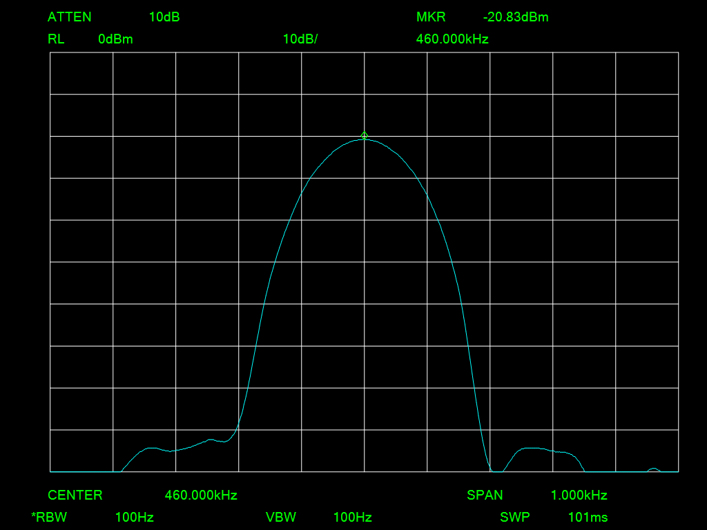

# Test fixtures

## test.plt

A real HP-GL/2 plot captured from an HP 8563E spectrum analyzer (graticule + trace +
marker + annotation). Used as a render-regression fixture for the
[`Hpgl.Rendering`](../src/Hpgl.Rendering/) library — see the linked GitHub issue.

Rendering it with the default options produces a correct spectrum-analyzer screen: a white
10×10 graticule on black, a cyan trace with a peak, a green marker diamond, and green
annotation (`ATTEN`, `RL`, `MKR`, `CENTER 460.000kHz`, `SPAN 1.000kHz`, `RBW/VBW 100Hz`,
`SWP 101ms`).

## test-expected.png

The **reference (golden) image** the renderer should produce for `test.plt`. Generated with the
library default options:

- `HpglRenderOptions` defaults — **1024×768**, **black** background, **antialias on**
- i.e. `HpglRenderer.RenderToPng(File.ReadAllBytes("test.plt"))`

Used by the render-regression test (GitHub issue #21) as the expected output. If the renderer is
changed and this image needs to be regenerated intentionally, re-render `test.plt` with the
options above and review the diff before committing.

